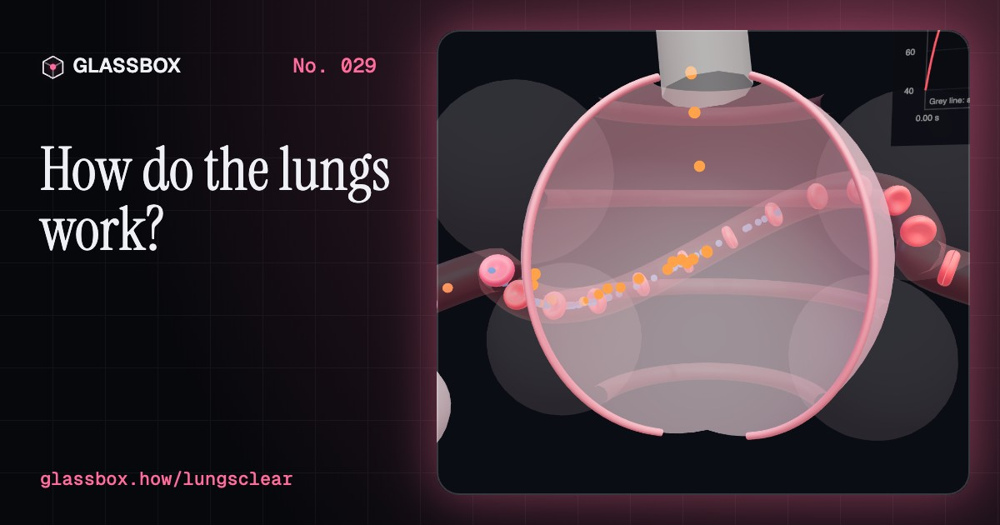
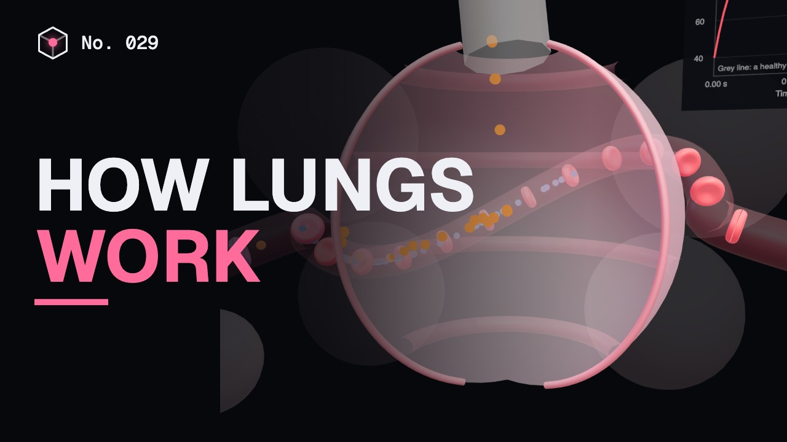
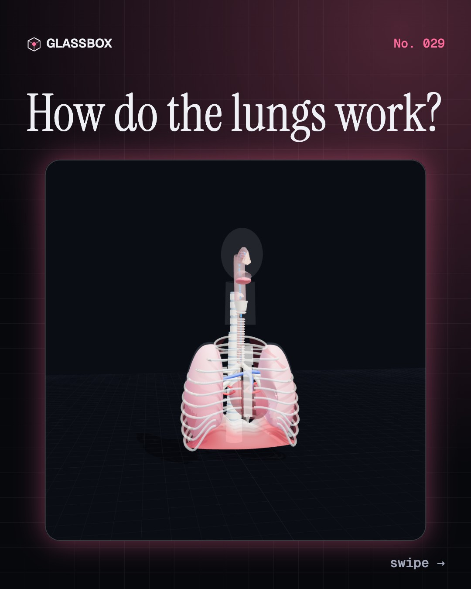
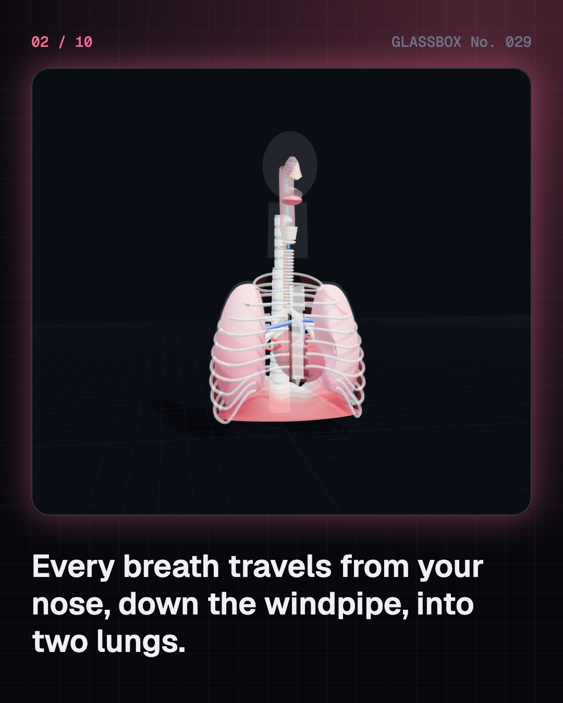
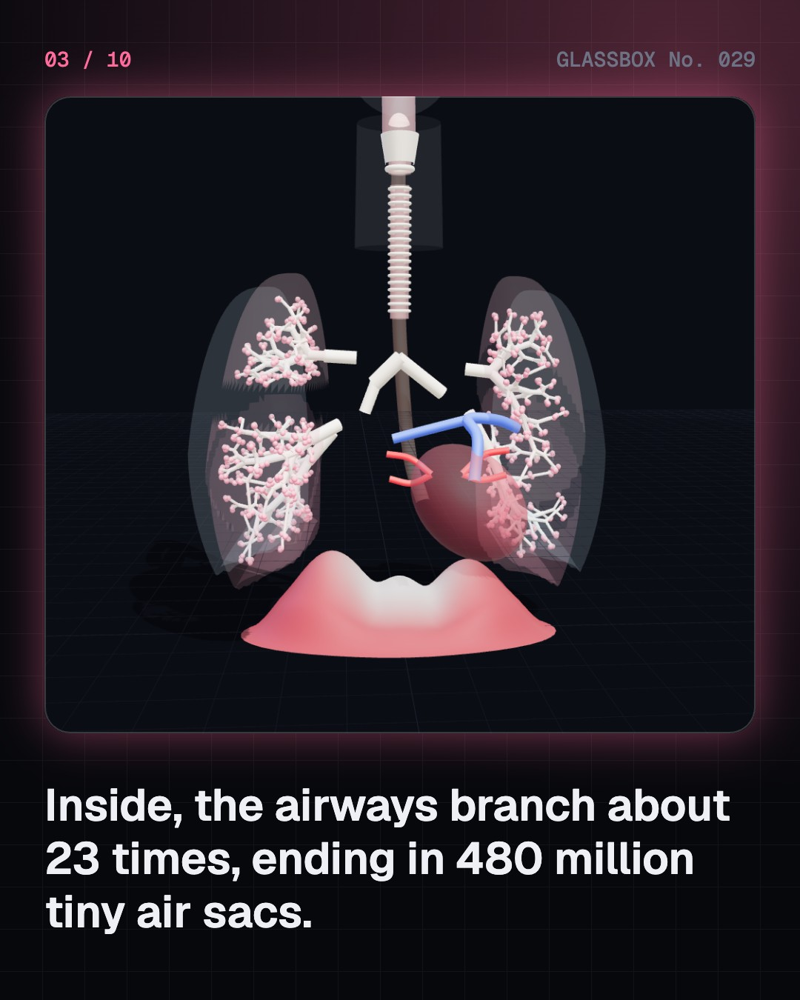
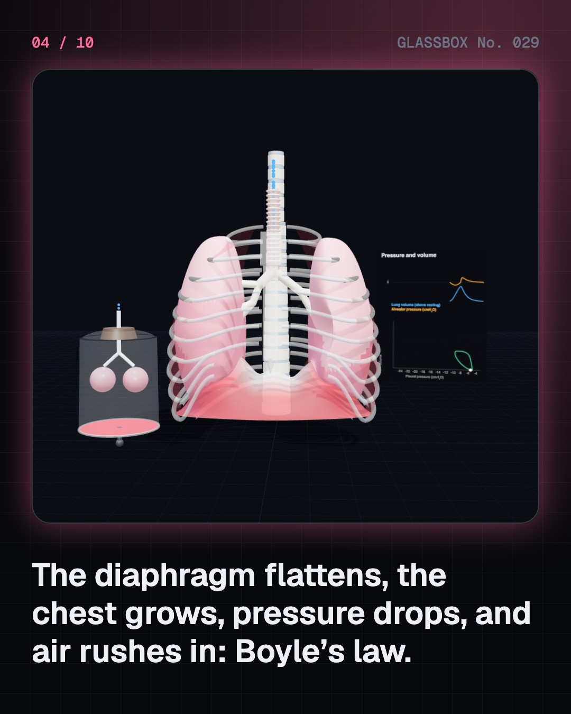

<!-- glassbox:start -->
<!-- Generated from glassbox.json by the Glassbox hub (npm run readme -- lungsclear). Edit glassbox.json, not this block. -->
<p align="center"><a href="https://glassbox-production-fd52.up.railway.app/e/lungsclear/"></a></p>

<h1 align="center">LungsClear</h1>

<p align="center"><b>How do the lungs work?</b><br>You breathe about 20,000 times a day without thinking. Follow one breath from your nose to 480 million tiny air sacs, and watch oxygen slip into your blood.</p>

<p align="center"><a href="https://glassbox-production-fd52.up.railway.app/lungsclear/"><b>▶ Play with it</b></a> &nbsp;·&nbsp; <a href="https://glassbox-production-fd52.up.railway.app/e/lungsclear/">Read the 60-second explainer</a> &nbsp;·&nbsp; <a href="https://glassbox-production-fd52.up.railway.app/lungsclear/glassbox/reel.mp4">Watch the 40-second video</a></p>

<p align="center">
  <a href="https://glassbox-production-fd52.up.railway.app/e/lungsclear/"></a>
  <a href="https://glassbox-production-fd52.up.railway.app/e/lungsclear/"></a>
  <a href="LICENSE"></a>
  <a href="LICENSE-CONTENT.md"></a>
  <a href="#privacy"></a>
</p>

## In 60 seconds

1. **A tree of air.** Air flows through your nose, throat and voice box into the windpipe, which splits into two bronchi. They branch about 23 times, ending in roughly 480 million tiny air sacs called alveoli. The right lung has three lobes; the left has two and a notch for the heart.
2. **Breathing is Boyle's law.** Your lungs have no muscles. The diaphragm flattens and the ribs lift, so the chest gets bigger. The air inside the lungs gets more room, its pressure falls about 1 cmH2O below the air outside, and air flows in. Breathing out at rest is just the lungs springing back.
3. **Swapping gases by diffusion.** Each alveolus is wrapped in capillaries, separated from the air by a wall about 0.5 micrometres thick. Oxygen diffuses from about 100 mmHg in the air sacs into blood arriving at 40; carbon dioxide goes the other way, 46 to 40. Spread flat, the alveoli would cover about 70 square metres.
4. **Haemoglobin does the carrying.** Each haemoglobin molecule holds four oxygen molecules, and its S-shaped binding curve fills blood to about 98% in the lungs. Heat, acid and CO2 make it let go in busy muscles. On Everest the air pressure is a third of sea level, and blood carries far less.
5. **How much air you hold.** A quiet breath is about 500 mL. A full breath out after a full breath in, the vital capacity, is around 4.5 to 5 litres for a young man, and about 1.2 litres always stays behind. How fast you can blow it out shows whether airways are narrowed.
6. **Keeping lungs clean.** Mucus traps dirt and cilia sweep it up to your throat. Smoking slows the cilia, PM2.5 pollution reaches deep into the lungs, and in asthma narrowed airways make breathing much harder, because resistance grows with one over the radius to the fourth power.

## Words worth knowing

| Term | Meaning |
|---|---|
| **Alveoli** | The hundreds of millions of tiny air sacs at the ends of the airways, where gases pass between air and blood. |
| **Diaphragm** | The dome-shaped muscle under the lungs. It flattens to pull air in and is the main muscle of breathing. |
| **Boyle's law** | At a fixed temperature, a gas's pressure falls as its volume grows. It is why a bigger chest pulls air in. |
| **Tidal volume** | The air moved in one quiet breath, about 500 mL for an adult at rest. |
| **Partial pressure** | The share of a gas mixture's pressure due to one gas. Gases diffuse from high partial pressure to low. |
| **Surfactant** | A soapy film lining the alveoli that lowers surface tension so they don't collapse. |
| **Haemoglobin** | The iron-containing protein in red blood cells that carries up to four oxygen molecules. |
| **Vital capacity** | The most air you can breathe out after breathing in as far as you can. |
| **PM2.5** | Airborne particles smaller than 2.5 micrometres, small enough to reach the alveoli. The WHO yearly guideline is 5 micrograms per cubic metre. |

## A short history

**2,000 years from ‘breath of life’ to pulse oximeters, ventilators and the fight for clean air.**

- **170** · Galen: breathing cools the heart (Galen of Pergamon, Rome, Roman Empire)
- **1242** · Blood goes through the lungs (Ibn al-Nafis, Cairo, Egypt)
- **1667** · Bellows keep a dog alive (Robert Hooke, Royal Society, London, England)
- **1774** · Oxygen is found (Joseph Priestley, Calne, England)
- **1777** · Breathing is a slow fire (Antoine Lavoisier, Paris, France)
- **1882** · The germ that causes TB (Robert Koch, Berlin, Germany)
- **1952** · Students breathe for polio patients (Bjørn Ibsen, Blegdam Hospital, Copenhagen, Denmark)
- **1959** · Why premature babies struggle to breathe (Mary Ellen Avery and Jere Mead, Harvard School of Public Health, Boston, USA)

The full story, with 30 moments, charts, people and 63 sources: [glassbox.how/e/lungsclear/history](https://glassbox-production-fd52.up.railway.app/e/lungsclear/history/). The data lives in [`history.json`](history.json).

## Video and slides

Made with the Glassbox studio from this box's storyboard (`window.glassbox.director`). Free to reuse under CC BY 4.0.

<a href="https://glassbox-production-fd52.up.railway.app/lungsclear/glassbox/video.mp4"></a>

<p><a href="glassbox/slide-1.jpg"></a> <a href="glassbox/slide-2.jpg"></a> <a href="glassbox/slide-3.jpg"></a> <a href="glassbox/slide-4.jpg"></a></p>

| File | What | Size |
|---|---|---|
| [`glassbox/reel.mp4`](https://glassbox-production-fd52.up.railway.app/lungsclear/glassbox/reel.mp4) | Reel / Short, with captions and soundtrack | 1080×1920 |
| [`glassbox/video.mp4`](https://glassbox-production-fd52.up.railway.app/lungsclear/glassbox/video.mp4) | YouTube video, with captions and soundtrack | 1920×1080 |
| `glassbox/slide-1…10.jpg` | Instagram carousel | 1080×1350 |
| `glassbox/thumb.jpg` | YouTube thumbnail | 1280×720 |
| `glassbox/cover.jpg` | Share card and repo social preview | 1200×630 |
| [`glassbox/history-reel.mp4`](https://glassbox-production-fd52.up.railway.app/lungsclear/glassbox/history-reel.mp4) | “History in 10 moments” Reel / Short | 1080×1920 |
| `glassbox/history-slide-*.jpg` | History carousel | 1080×1350 |
| `glassbox/post.json` | Post copy and schedule used by the publish kit | |

## Privacy

This box has no accounts and no ads, and it ships its own fonts and libraries. When you run it yourself it sends nothing anywhere. On glassbox.how, the site's `/bar.js` also loads Glassbox's analytics: **Google Analytics** to count visits (it asks first in the EU, UK and Switzerland, and stays off when your browser sends Global Privacy Control or Do Not Track) and **ClickTrust** to detect bots.

It remembers a few things **in your own browser only**, and never sends them anywhere:

| Browser storage key | What it holds |
|---|---|
| `lungsclear.v1` | Which chapters you have opened, your best quiz scores, and sound on or off. |

Exactly what each one sees is at [glassbox.how/privacy](https://glassbox-production-fd52.up.railway.app/privacy/).

## Licences

- **Code:** [MIT](LICENSE). Use it, change it, ship it.
- **Explanations, text, images and videos** (`glassbox.json`, `glassbox/`): [CC BY 4.0](LICENSE-CONTENT.md). Credit “Glassbox, glassbox.how/e/lungsclear”.
- **Third-party parts** keep their own licences: [three.js](https://threejs.org) (MIT), [Geist, Instrument Serif](https://openfontlicense.org) (SIL OFL 1.1).
- The Glassbox name and logo aren't covered by either licence. See the [terms](https://glassbox-production-fd52.up.railway.app/terms/).

Found a mistake? [Open an issue](https://github.com/bdeeps/lungsclear/issues). Corrections happen in public.
<!-- glassbox:end -->

## Run it

It's plain HTML, CSS and JavaScript. No build step and no dependencies. Run locally, it contacts no other website.

```bash
python3 -m http.server 8000
```

Three.js and the fonts ship in `vendor/` and `fonts/`, so it also works offline.

Then open http://localhost:8000.

## How it's built

| File | What |
|---|---|
| `index.html`, `css/app.css` | The page and its styles |
| `js/app.js`, `js/stage.js`, `js/ui.js`, `js/kit.js` | The shared Glassbox 3D engine: chapters, 3D stage, controls, quiz, video director |
| `js/chapters/*.js` | One file per chapter: the 3D model, controls, text, key terms, quiz and video scenes |
| `js/lungs.js` | LungsClear's shared models: breathing mechanics, the oxygen curve, altitude and spirometry maths (with sources), and the 3D airway, lungs, bronchial tree, rib cage and diaphragm |
| `glassbox.json` | Title, question, explainer beats, key terms, browser storage and credits shown on glassbox.how |
| `reel` in each chapter | The storyboard the Glassbox studio records into short videos |
| `glassbox/` | The published video, slides, thumbnail and post copy |
| `fonts/`, `vendor/three/` | Self-hosted Geist and Instrument Serif (SIL OFL 1.1) and three.js (MIT) |
